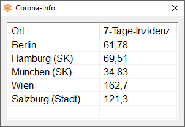

# Corona-Info

Anzeige der 7-Tage-Inzidenzen für Landkreise / Bezirke von Deutschland und Österreich.

## Konfiguration

In der Datei `config.csv` können bis zu 6 Landkreise / Bezirke in jeweils einer Zeile eingetragen werden.
Zuerst mit dem Länderkürzel `DE` oder `AT` gefolgt von einem Komma `,`und anschließend dem Namen des Landkreises
/ Bezirkes aus den folgenden Listen:
- Deutschland: https://raw.githubusercontent.com/jgehrcke/covid-19-germany-gae/master/more-data/latest-aggregate.csv
  - `SK` und `LK` bei einem Eintrag muss mit übernommen werden.
  - `Berlin` umfasst ganz Berlin, die einzelnen Bezirke sind nach dem Schema `SK Berlin ...` benannt.
- Österreich: https://covid19-dashboard.ages.at/data/CovidFaelle_GKZ.csv
  - Vor `(Stadt)` und `(Land)` darf wie im Original kein Leerzeichen enthalten sein!

Beispiel config.csv:

    #Land,Ort
    DE,Berlin
    DE,SK Hamburg
    DE,SK München
    AT,Wien
    AT,Salzburg(Stadt)

## Download
Windows: 

## Einbindungen von Dritten
Split-Routine von wilbert: https://www.purebasic.fr/english/viewtopic.php?p=486360#p486360 \
Icon von Everaldo: https://iconarchive.com/show/crystal-clear-icons-by-everaldo/App-virus-detected-icon.html

## Daten-Quellen
COVID-19 Fallzahlen Deutschland von Jan-Philip Gehrcke: https://github.com/jgehrcke/covid-19-germany-gae/ \
Open Data Österreich: https://www.data.gv.at/katalog/dataset/2f6649b6-2b2d-49a9-ab31-6c7e43728001

## Lizenz und Urheberrecht
Diese Software unterliegt dem Urheberrecht von alexgit2k.

Freie Software, lizenziert unter der MIT-Lizenz. 
